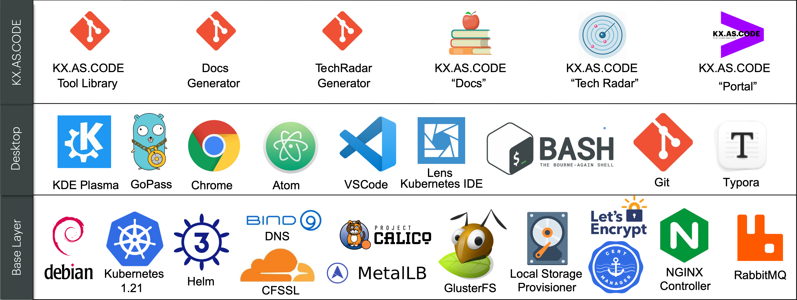

# Welcome!

Welcome to the KX.AS.CODE learning workstation. This virtual workstation was created with two primary goals in mind.

*   Play, learn, experiment, fail, learn, succeed :muscle: :trophy:
*   Share knowledge a code!

As well as learning and sharing knowledge, there are several more use cases for this KX workstation. Here just a few more:

*   Use it for demoing new technologies/tools/processes
*   Keep your physical workstation clean whilst experimenting
*   Have fun playing around with new technologies
*   Use it as an accompaniment to trainings and certifications
*   Experimenting and innovating

## What is the KX.AS.CODE Workstation?

It can be considered as a local cloud like Kubernetes environment with a lot of things you would expect to see when managing a Kubernetes cluster in the cloud, including an ingress controller, storage cluster, DNS, a certificate authority... and the best bit, you just have to fill out a couple of config files and vagrant up/terraform apply, and you are on your way!

For the full guide on KX.AS.CODE, read full [documentation](https://accenture.github.io/kx.as.code/).

## What are we currently working on?

<b>Raspberry Pi enablement! :heart: </b> 

Whilst the solution already works on Parallels, VirtualBox, VMWare, OpenStack and AWS, it's time to prepare for ARM64 compatibility. Currently, KX.AS.CODE is limited to running on AMD64 CPU architectures. The Raspberry Pi project will add ARM64 to the mix. Once done, the next step will be to test and optimize for Mac M1/M2 CPUs as well.
This is also the first time we run KX.AS.CODE on bare-metal, which is an additional bonus. :smile:
Here some screenshots from our current project.

## Screenshots

Here some impressions of KX.AS.CODE. Read our [documentation](https://accenture.github.io/kx.as.code/) on GitHub Pages for a more comprehensive view on KX.AS.CODE.

