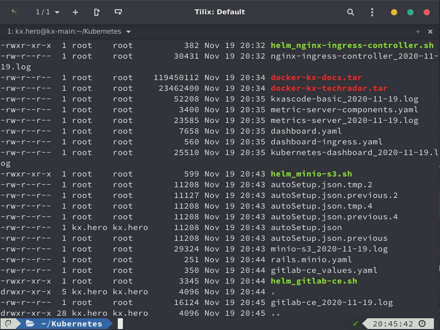
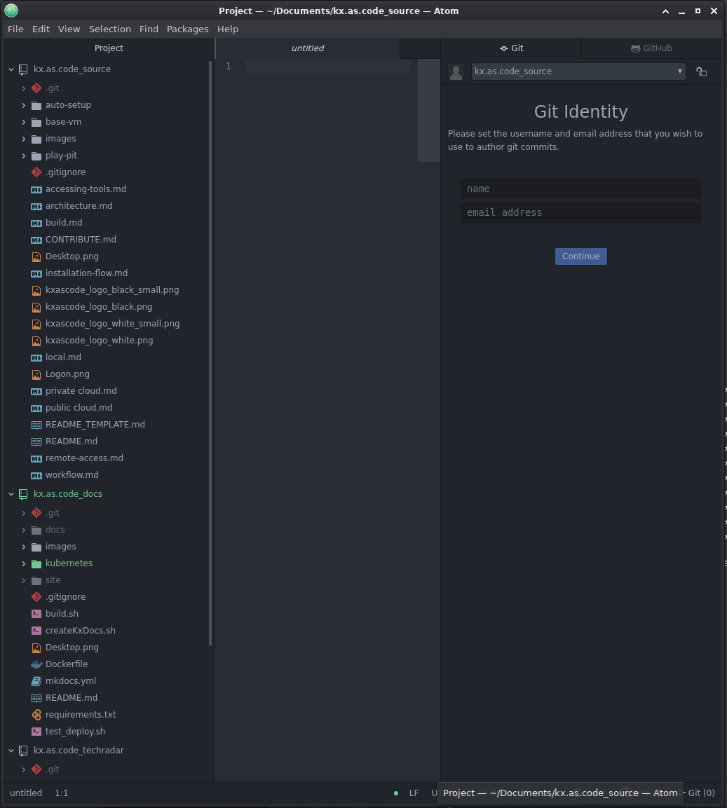
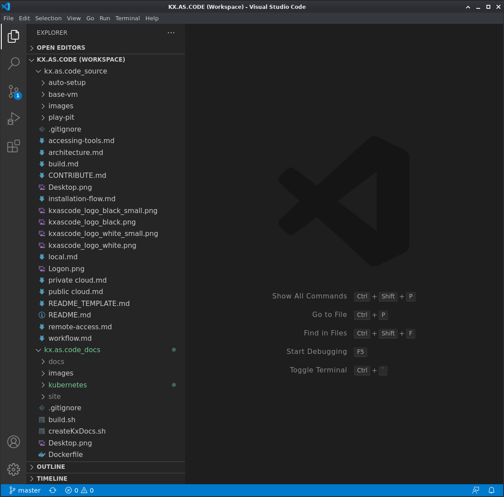

# Debugging

## Logs

Logs are held in /home/`${vmUser}`/Kubernetes.

Each solution has it's own logs.

If you execute `ls -altr` in this directory, you will see the component currently being installed at the bottom of the list. In this example it is gitlab-ce.

{: align=left }

If any component fails, the items is move from the `wip_queue` to the `failed_queue`.

Once that happens, no further items on the pending queue will be processed until resolved and removed from the pending queue.

There are two choices to move the item off the failed_queue.

1. Purge the failed_queue
2. Move it to the retry_queue

Failure could be anything from no internet access to running out of disk space, or even Kubernetes not having enough resources to install any more pods.

If you have enough physical capacity, you could just add another node, or alternatively, allocate more CPU/memory to the existing ones.

Running out of disk space would involve adding another node, or reducing the persistent volume claim to make the solution fit into the available capacity.

If you manage to fix it, move the message from the `failed_queue` to the `retry_queue`.

If you want to fix it later and continue with installing the rest of the items in the pending_queue, then simply purge the message from the `failed_queue`

See [manual-triggers.md](manual-triggers.md) for more details on managing the queues.

## Helm Specifics

For `Helm` based installation you can see not only the logs, but also the Helm commands and the `values.yaml` file.

Here for the Mattermost installation you can see three files:

- Helm script

- Helm values file

- Log output

{: align=left }

Analysing these may also help to determine what went wrong.

## Checking the code

Finally, if you need to check the scripts, you will find all source code under `~/Documents/kx.as.code_source`.

Read  [CONTRIBUTE.md](CONTRIBUTE.md) if you want to share any fixes on how to contribute to this project.

To make things easier, the KX.AS.CODE Git repositories are pre-configured into the Atom and VSCode applications.

### Atom

{: align=left }

### VS Code

{: align=left }
