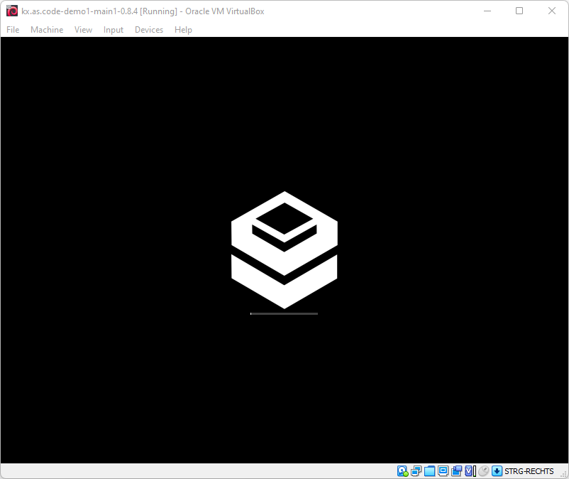
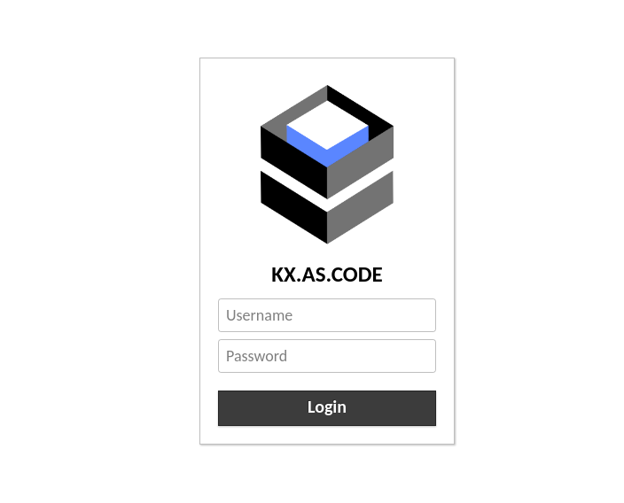

# Customizing

You don't need to code to give KX.AS.CODE the look and feel you desire. If you add certain files to the profile directory, they will automatically be picked up and distributed as needed.

Here a short table detailing which files to drop for which customization.

| Filename | Target | Recommended Size (px) | Comments | Screenshot |
| ---- | ---- | ---- | ---- | ---- |
| User Profile Avatar | avatar.png | 512 x 512 | This will update the user's user Avatar. Per default the avatar is selected automatically at random |  |
| Desktop Wallpaper | background.jpg | 3840 x 2160 | This will update the desktop background |  |
| Desktop Conky Logo | conky_logo.png | 1000 x 500 | This will update the Conky widget, displayed top right on the desktop |  |
| Boot Logo | boot.png | 220 x 120 | This will update the KX.AS.CODE boot Plymouth theme. Not applicable for private and public cloud installations |  |
| Guacamole Remote Desktop Logo | logo_icon.png | 200 x 200 | Several sizes are needed. Backend processing will take care to create the 4 needed sizes |  |

As KX.AS.CODE is not just a Kubernetes environment, but a framework, there are many more ways to customize KX.AS.CODE.
This page concentrated primarily on the customization of visual components.

See the following pages for customizing functionality.

- [Use-Case Example](../../Overview/Use-Case-Example/)
- [Components to install](../../Overview/Application-Library/)
- [Add your own installation groups](../../Deployment/Provisioning-Templates/)
- [Profile customization, including domain name etc](../../Deployment/Configuration-Options/)
- [Adding custom component walk-through](../../Development/Adding-a-Solution/)
- [Adding custom central functions](../../Development/Central-Functions/)
- [Customizing component metadata](../../Development/Solution-Metadata/)