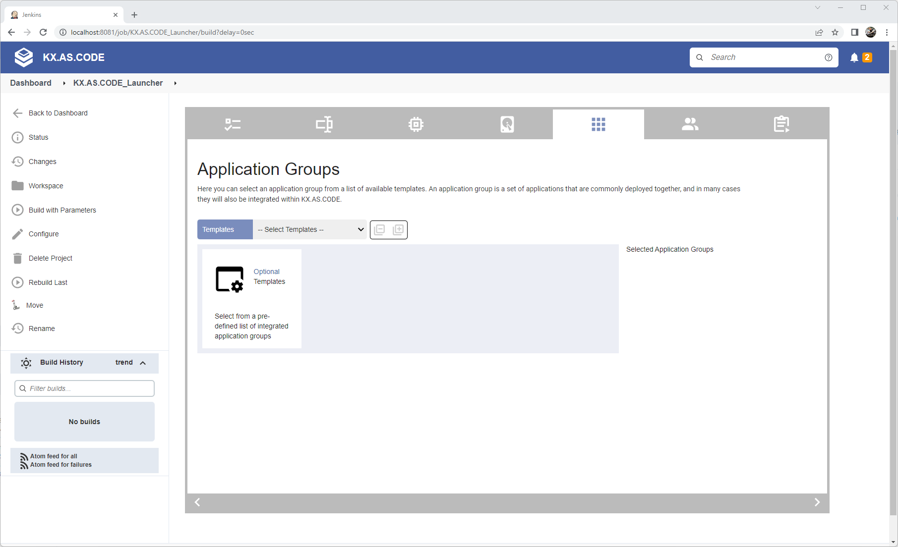

# Minimal Deployment

For host systems with low cpu and memory resources, it is best to start KX.AS.CODE with a minimal setup.

Here are the steps to make that happen:

1. Select `Minimal` startup mode and `K3s` as the Kubernetes orchestrator
{: .zoom}

2. Select `Standalone mode`, `Allow Workloads on Master` and `Disable Linux Desktop` on General Parameters config panel
{: .zoom}

3. Ensure only 1 Main node is selected, and 0 worker nodes
{: .zoom}

4. Ensure no group installation templates are selected, so that you can add apps individually later, depending on the remaining available resources
{: .zoom}

5. Review your settings and click play!
{: .zoom}

!!! info
    This guide is still a work in progress.