# Adding a Solution

Adding a new solution is straightforward.

First an important note, relevant regardless of the chosen installation method (eg. ArgoCD, Helm or Scripts).

!!! note
    The configuration file, `metadata.json`, is absolutely mandatory for each component directory. This tells the KX.AS.CODE installation framework exactly what and how to install the application in question.
    See the following guide that describes `metadata.json` in detail.

Below an example walk-through adding NeuVector as an application installed via the helm installation method.

!!! tip
    Remember that there are many [functions](/Development/Available-Functions/) available that you can directly utilize in your scripts.

1. Determine category. Current available categories are as follows:

| Category | Examples |
| --- | --- |
|cicd| Gitlab, TeamCity, Artifactory, Nexus3, Jenkins |
|collaboration| RocketChat, Mattermost, Jira, Confluence, WikiJs |
|dev_tools| BackStage, Atom, Postman|
|monitoring|Prometheus, Tick-Stack, Elastic-Stack, Loki-Stack, Netdata |
|quality_assurance|Selenium-Grid, SonarQube|
|security|Hashicorp Vault, Sysdig Falco|
|storage|Minio-S3|

2. Determine install method (ArgoCD, Helm or purely Script based)

3. Create the needed directory structure for the desired installation method

##### Helm

Below a work through for adding an application with helm.


3. Create a values_template.yaml file and add the correct contents (adjust the solutions default https://github.com/neuvector/neuvector-helm/blob/master/charts/core/values.yaml, and modify as per the solution's documentation (https://github.com/neuvector/neuvector-helm/tree/master/charts/core)
4. Check if there is a newer image tag and correct if available (ensure new verison matches chart. highly likely if only minor version number increased, like with NeuVector 5.0.0 -> 5.0.1)
5. Add the image as an environment variable in metadata.json and then use the mustache annotation in the values.template

### Create the base directories.   
{: .zoom}

### Populate the directory with the relevant files

The number of scripts or screenshots will differ per solution per solution. 

<pre><code>├── auto-setup
│   ├── security
│   │   └── <b>neuvector</b>
│   │       ├── post_install_scripts
│   │       │   ├── change_admin_password.sh
│   │       ├── pre_install_scripts
│   │       │   ├── create_certs_secret.sh
│   │       │   ├── create_service_account.sh
│   │       ├── screenshots
│   │       │   ├── neuvector_screenshot1.png
│   │       │   ├── neuvector_screenshot2.png
│   │       │   ├── neuvector_screenshot3.png
│   │       │   ├── neuvector_screenshot4.png
│   │       │   ├── neuvector_screenshot5.png
│   │       │   ├── neuvector_screenshot6.png
│   │       │   └── neuvector_screenshot7.png
│   │       ├── <b>metadata.json</b>
│   │       ├── neuvector.png
│   │       └── values_template.yaml</code>
</pre>

In NeuVector we created 7 screenshots. This may vary from solution to solution. The naming convention is important here, so that they are picked up by the KX-Portal.


### Create metadata.json and values_template.yaml
Best to copy the helm values file from the solution's GitHub repository and modify it to match the KX.AS.CODE environment.

For a simple solution, it is also possible to get away with only having the base directory and metadata.json, since it is possible to represent change to the `Helm values file` also in the form of a `set_values` block in `metadata.json`.
Taking the example for the values file added for NeuVector, the json in metadata.json would look as follows:

```json linenums="1" hl_lines="6 11 12"
    "helm_params": {
        "repository_url": "https://neuvector.github.io/neuvector-helm/",
        "repository_name": "neuvector/core",
        "helm_version": "2.2.0-b2",
        "set_key_values": [
            "tag={{imageTag}}",
            "controller.ingress.enabled=true",
            "controller.ingress.tls=true",
            "controller.ingress.secretName=kx-certificates",        
            "controller.ingress.ingressClassName=nginx",
            "controller.ingress.host[0]={{componentName}}.{{baseDomain}}",
            "controller.ingress.path=\/",
            "controller.pvc.enabled=true",
            "controller.pvc.capacity=1Gi",
            "controller.pvc.storageClass=gluster-heketi"
        ]
    }
```

!!! tip 
    Notice also the `{{ mustache }}` variables in the `set_key_values[]` block. These will also be replaced automatically with both global variables and those in `metadata.json`.
!!! warning
    Important. As in the example, `/` must be escaped with a `\`
!!! note
    The above snippet is just an example and doesn't represent all the changes made to the values file for NeuVector.

In this example however, we have chosen not to do that, and to create the `values_template.yaml` instead. See screenshot.
It is also possible to mix, and have both the JSON and the values file. As per `Helm` standard, the `set_values` will override those in the values file.

Notice in `metadata.json` the set environment variable `imageTag`, and how it is referenced in `values_template.yaml` as `{{imageTag}}`.
The KX.AS.CODE framework will automatically substitute the placeholder in `values_template.yaml` with the variable in `metadata.json`.

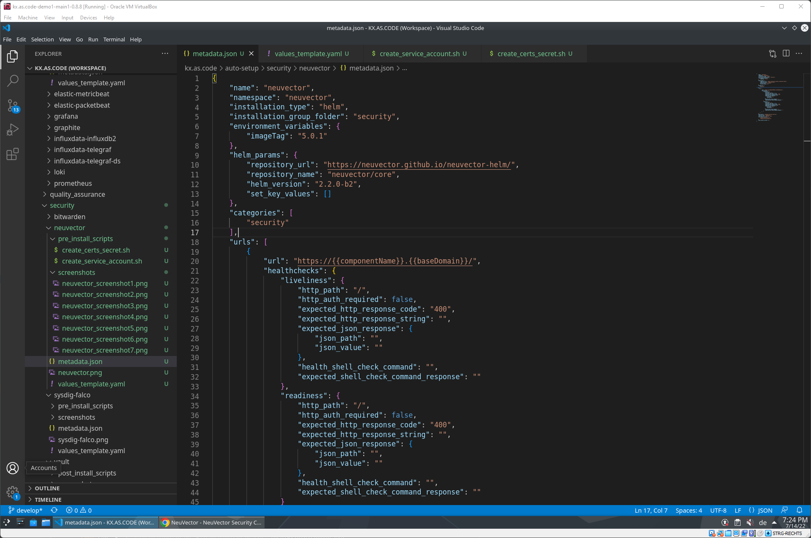{: .zoom}
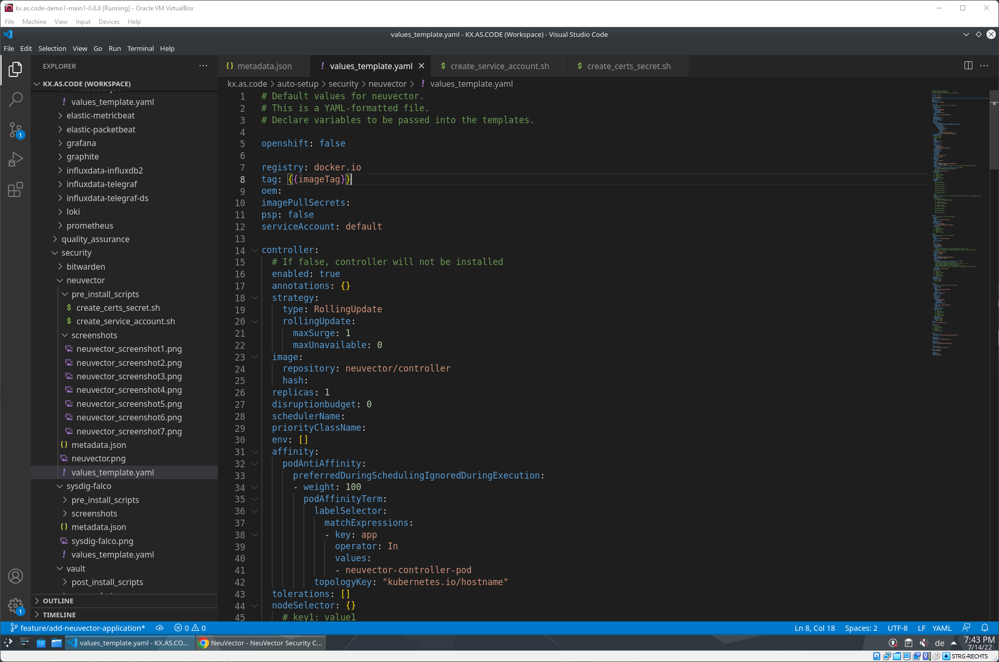{: .zoom}

### Test the developed solution

Once the initial development is done, publish the new solution to the message queue, in order to test it.

<pre>
<code>
<span style="white-space: pre-wrap;">rabbitmqadmin publish exchange=action_workflow routing_key=pending_queue payload='{"install_folder":"security","name":"neuvector","action":"install","retries":"0"}'</span>
</code>
</pre>

Once the message is added to the pending_queue, you should get an installation started message.

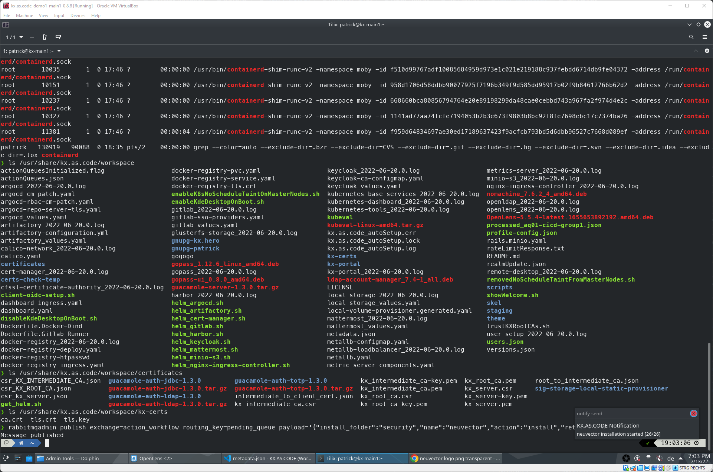{: .zoom}

### Check that the solution came up successfully

For demonstration purposes, this one failed. Open either the `Kubernetes Dashboard`, the `OpenLens` application, or use the `kubectl` CLI, to figure out what went wrong.
In our example, it was an incorrect setting on the `pvc`.
{: .zoom}
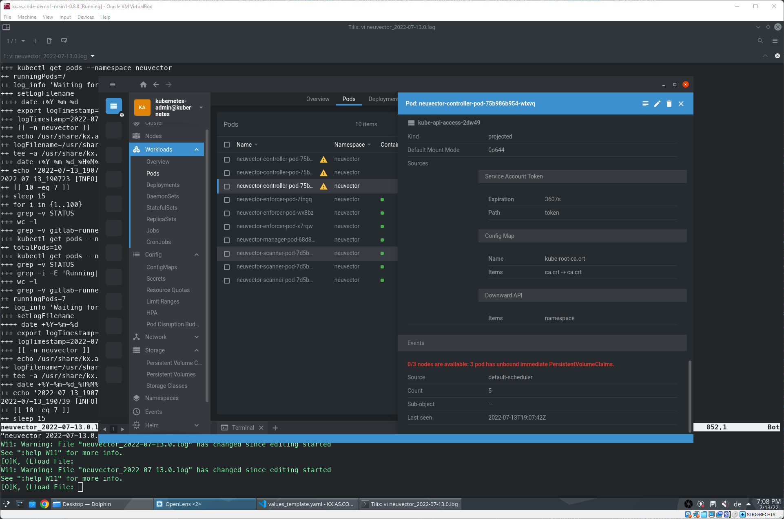{: .zoom}

### Once fixed, move item to the restart queue

Go to the RabbitMQ admin folder on the desktop and open RabbitMQ.
Once open, go to Queues, and figure out if the message is in the `failed_queue` or `wip_queue`.
If on the `failed_queue`, enter that queue and move it to the `retry_queue`. The new attempt to install should start shortly after.
If on the `wip_queue`, use the GUI to move the message to the `retry_queue`. In this event, you will also need to restart the poller, as the old run will still be executing.

`sudo systemctl restart kxAsCodeQueuePoller.service`

!!! warning 
    In some cases it may be needed to also un-install the application before re-installing, if for example fixing a Kubernetes resource that is not changeable. This can be done with

    helm uninstall _<application name\>_ --namespace _<namespace\>_

    `helm uninstall neuvector --namespace neuvector`

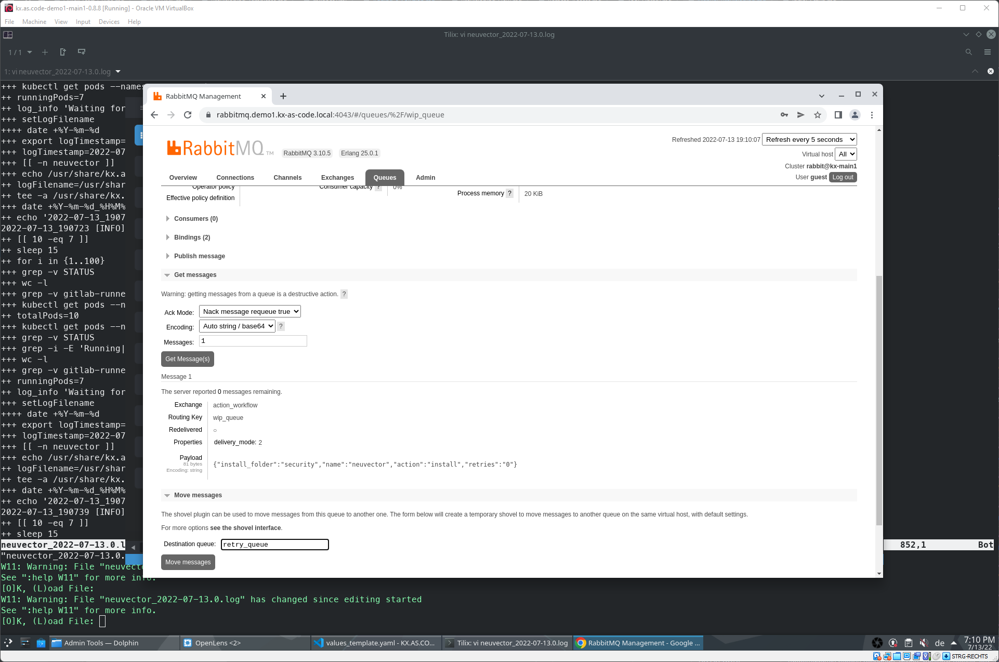{: .zoom}
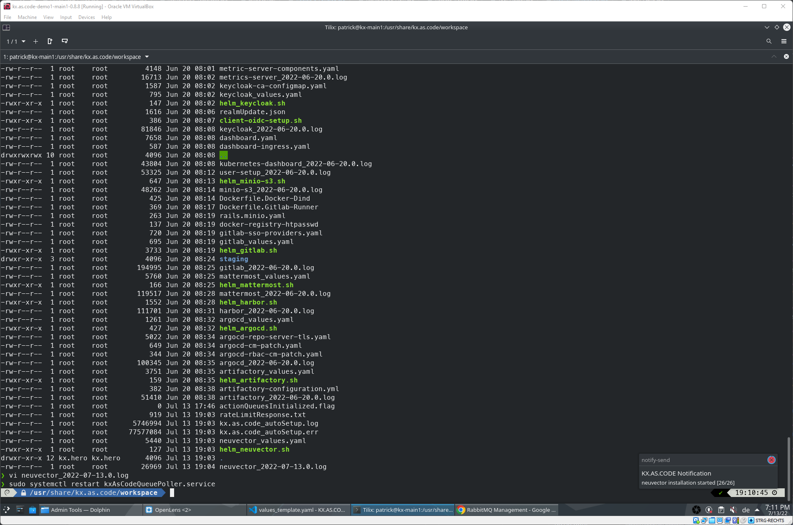{: .zoom}

### Re-Test Application
Once the installation is successful and all pods are green, check that the desktop icon has appeared in the Desktop's Applications folder with the correct icon and tha the page opens up correctly and is functional, eg. login works and there are no errors inside the application.

{: .zoom}
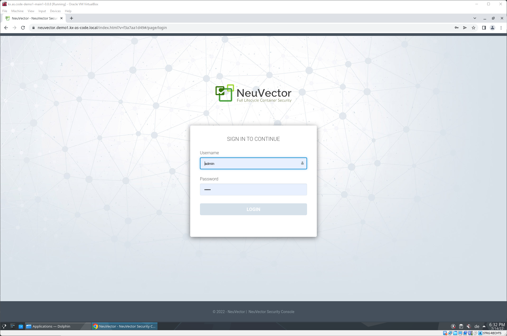{: .zoom}
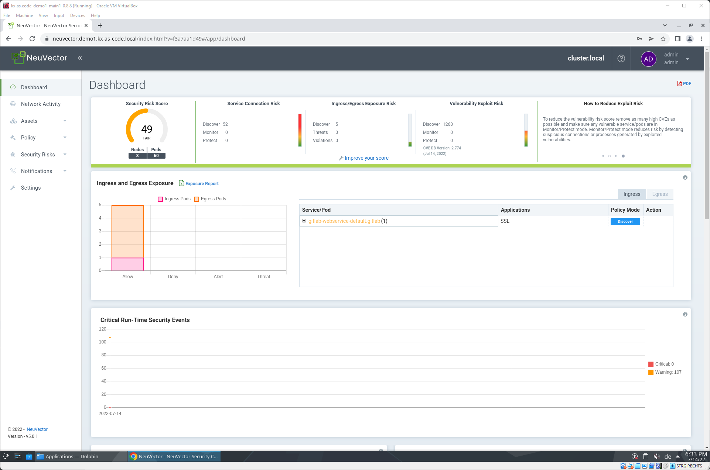{: .zoom}

### Commit the Code to Github.com

Start by creating a new feature from the develop branch (if you didn't already before you started developing).

<pre>
<code>
git checkout develop
<span style="opacity: 0.5">#git checkout -b feature/add-<i>&lt;name of application&gt;</i>-application</span>
git checkout -b feature/add-neuvector-application
</code>
</pre>

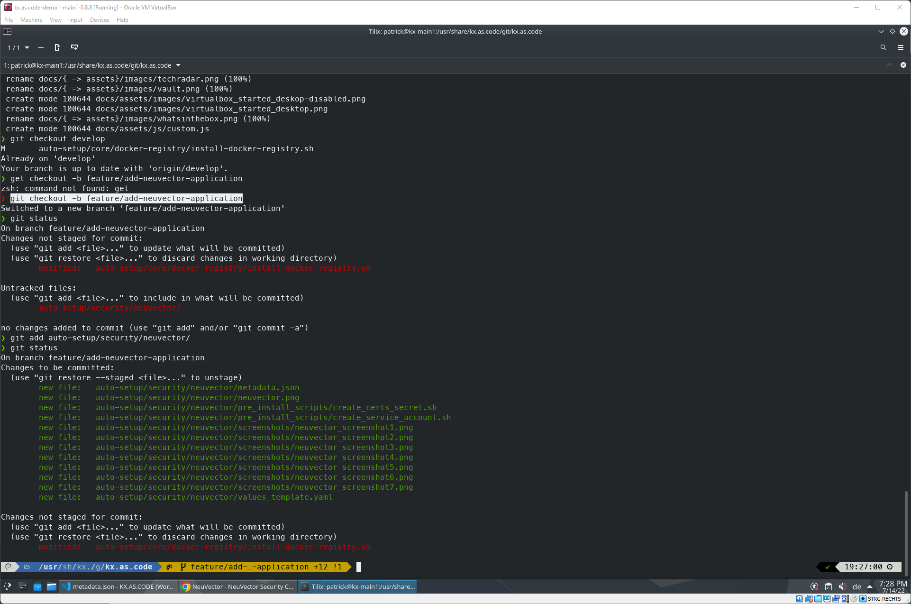{: .zoom}

You can also complete the actions in the VSCode built into the KX.AS.CODE VM, such as here, completing the final commit and push of the code, after creating the feature branch on the command line.

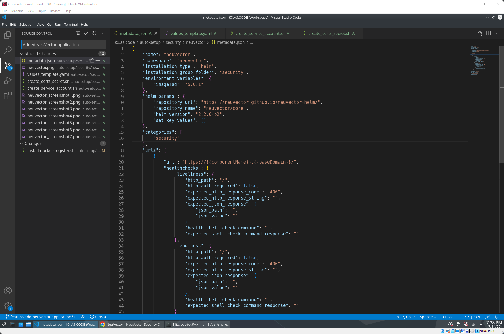{: .zoom}

Once committed, go to [Github.com](https://github.com/Accenture/kx.as.code/compare){:target="\_blank"} and create a [pull request](https://docs.github.com/en/pull-requests/collaborating-with-pull-requests/proposing-changes-to-your-work-with-pull-requests/creating-a-pull-request){:target="\_blank"}.

{: .zoom}

Someone from the core KX.AS.CODE development team will review your change and either approve and merge right away, or provide feedback on any required changes.

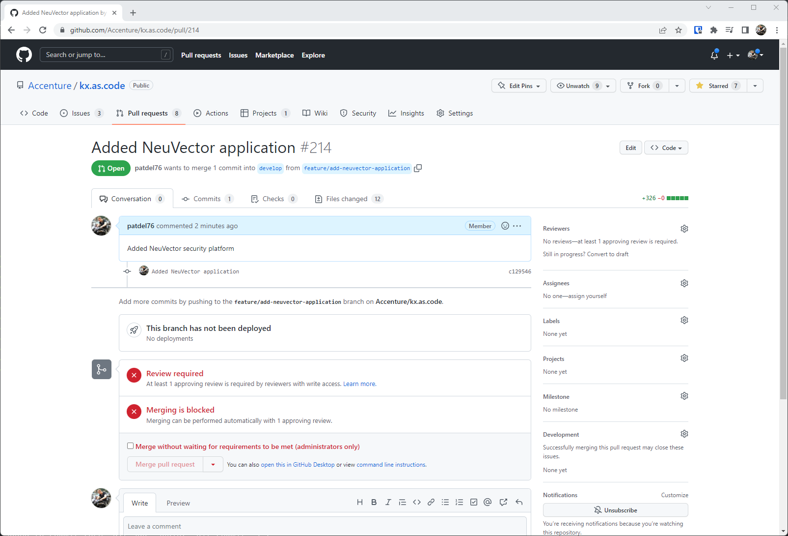{: .zoom}


##### ArgoCD

##### Scripts

