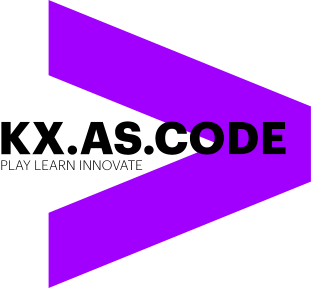

# README

## Description
MinIO is an OpenSource S3 storage solution.

"MinIO is High Performance Object Storage released under Apache License v2.0. It is API compatible with Amazon S3 cloud storage service. Using MinIO build high performance infrastructure for machine learning, analytics and application data workloads." - Min.io

## Screenshots


## Metdata

- Author: [Patrick Delamere](mailto:patrick.g.delamere@accenture.com)
- Code Link: [GitLab Repository](https://dev.ares.accenture.com/gitlab/kx.as.code/kx.as.code/-/tree/master/play-pit/08_Storage/01_MinIO)
- VM Location: `/home/kx.hero/Documents/kx.as.code_source/play-pit/08_Storage/01_MinIO`
- Application URL: [https://s3.kx-as-code.local](https://s3.kx-as-code.local)

## Architecture
This setup consists of MinIO only. MinIO just needs a persistent volume to use as it's data store.

## Assumptions
Docker and Kubernetes is installed and working.

## Required Components
- Docker
- Kubernetes
- Kubectl
- Internet Access (to pull images from docker.io)

## Important Information / Pitfalls
There ae no known issues at this time.

## Installation

### Installing MinIO

```bash
# Change into the directory where the MinIO YAML files are located.
cd $HOME/Documents/git/kx.as.code_library/02_Kubernetes/08_Storage/01_MinIo-S3

# Create the directories
$ ./createVolumeDirectories.sh

# Now deploy the application
$ kubectl apply -f .

# Create the desktop shortcut
$ ./createDesktopShortcut.sh
```

## Configuration
There are no additional configuration steps other than those already outlined above.
However, to logon you will find the MinIO access tokens inside the deployment YAML file.
If you using this solution outside of the KX.AS.CODE workstation, you will want to change these access codes.

## Usage
Read the MinIO documentation:
https://docs.min.io/

### Troubleshooting
Currently none.
